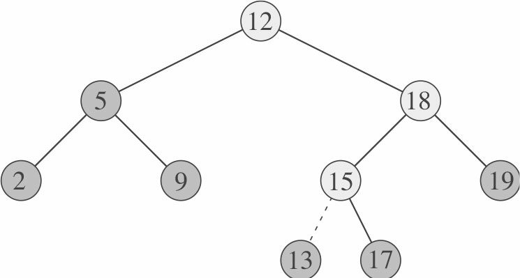
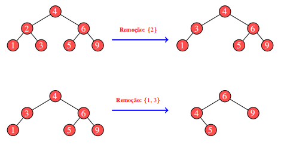
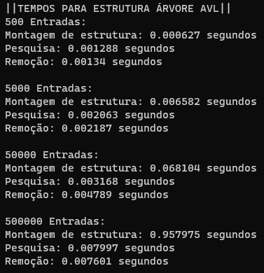
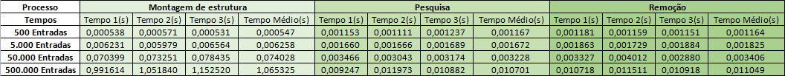

# Trabalho sobre Comparação das estruturas em árvore
[](https://github.com/TFIDF-Project)
[](https://code.visualstudio.com/docs/?dv=linux64_deb)

<h1> Comparação de diferentes estruturas com diferentes tamanhos de entrada

## Conteúdos

<p align="center">
    <a href="#apresentação">Apresentação</a> •
    <a href="#introdução">Introdução</a> • 
    <a href="#estruturas-e-suas-implementações">Estruturas e suas implementações</a> •
    <a href="#resultados-e-análises">Resultados e Análises</a> •
    <a href="#conclusão">Conclusão</a> •
    <a href="#bibliotecas">Bibliotecas</a> •
    <a href="#compilação-e-execução">Compilação e Execução</a> •
    <a href="#referências">Referências</a> •
    <a href="#autor">Autor</a>

</p>

---

## Apresentação

Foi proposto pelo professor [Michel Pires da Silva](http://lattes.cnpq.br/1449902596670082) da matéria de `Arquitetura e Estruturas de Dados 2 do 4º Período do curso de Engenharia de Computação` um trabalho relacionado ao conteúdo passado em suas aulas teóricas que são `Estrutura de Dados Árvore`, onde foi introduzido uma comparação de tempo entre diversas implementações sob diferentes volumes de dados em três tipos de árvores sendo elas, <a href="#•-árvore-binária-de-pesquisa">Árvore Binária de Pesquisa</a>, <a href="#•-árvore-avl">Árvore AVL</a> e <a href="#•-árvore-redblack">Árvore RedBlack</a> e outras diferentes estruturas sendo __vectors__ e <a href="#•-estruturas-maps">MAPs</a>. Portanto foi proposto o seguinte desafio:

*Chegou o momento de compararmos tais estruturas, observando seu comportamento sob diferentes volumes de dados. Para tanto, elabore arquivos que contenham 500 , 5000 , 50.000 , 500.000 entradas numéricas do tipo ponto flutuante. Para tanto, tente evitar repetições de valores em grande escala para que possamos ter uma estrutura profunda. Considere produzir os menores a partir dos maiores volumes de forma randômica. Feito a isso, vamos testar os seguintes processos:*

*1) - Qual o tempo gasto com pesquisa para um arquivo de entrada com 10.000 consultas. Considere como consulta a busca de um determinado número na estrutura escolhida. Para cada pesquisa, é preciso remover o elemento da árvore, retornando esse número para o usuário. Então, considere o processo de remoção como parte final do processo.*

*2) - Qual o tempo necessário para montar a estrutura em memória.*

*3) - Qual o ganho dessas estruturas ao compará-las a vetores ordenados e aplicados à pesquisa binária. Qual o tempo gasto com a ordenação do vetor? Foi possível produzi-lo em memória?*

*4) - Adotando como estrutura o map e unorder_map do C++, há ganhos maiores nesse processo de pesquisa?*

*Elabore um relatório detalhando a implementação dessas estruturas, funcionamento da aplicação, exemplo de resultado, modo de compilação e conclusões. Considere essa última seção como uma discussão de quando adotar cada estrutura acima citada e o por quê de tal escolha. Para toda essa discussão, apresentar gráficos que demonstrem os resultados obtidos durante o processo de análise.*

Com isso, foi desenvolvido um algoritmo baseado na proposta, onde foi possível obter as seguintes conclusões presentes em <a href="#conclusão">Conclusão</a>!

---

## Introdução

Para introduzir o problema proposto primeiramente foi necessário a criação dos cinco diferentes arquivos sendo quatro deles contendo os diferentes tamanhos de entrada do tipo _float_ e um contendo 10.000 entradas do tipo _float_ utilizado para consultas, sendo possível encontra-los na pasta *__src/files__* para verificação. A criação dos arquivos foi necessária apenas uma vez para manter o padrão de testes, após isso foi removido as funções de criações.

Após a criação dos arquivos foi necessário a implementação dos diferentes tipos de `Estrutura de Dados Árvore` onde foram utilizadas através de repositórios feitos pelo professor [Michel Pires da Silva](http://lattes.cnpq.br/1449902596670082), sendo eles, [Árvore Binária de Pesquisa](https://github.com/mpiress/basic_tree), [Árvore AVL](https://github.com/mpiress/avl_tree) e [Árvore RedBlack](https://github.com/mpiress/RedBlack) onde na última estrutura foi necessária a implementação do método de _remoção_ onde foi encontrado o mesmo no livro do [1]Cormem em forma de pseudocódigo, sendo feita apenas algumas alterações no código principal para que fosse possível ser feita a implementação da _remoção_ sem nenhum problema. Sendo feita essas implementações foi necessário implementar a utilização de __*vectors*__ e estruturas do tipo __*MAPs*__ encontrando informações em [2] para uma implementação sem erros;

## Estruturas e suas implementações

### • Árvore Binária de Pesquisa

__*<u>O que é uma Árvore Binária de Pesquisa?</u>*__

Uma Árvore Binária de Pesquisa é organizada, como o nome sugere, em uma árvore binária como mostra a _Figura 1_. Sendo uma estrutura baseada em nós, onde todos os nós da subárvore esquerda possuem um valor númerico interior ao nó raiz e todos os nós da subárvore direita possuem um valor superior ao nó raiz, sendo essa a forma padrão. Essa estrutura possue o objetivo de estruturar os dados de forma a permitir <a href="#busca-binária">Busca Binária</a>.
Esse tipo de estrutura suporta muitas operações de conjuntos dinâmicos, incluindo _<a href="#operação-de-busca">busca</a>, mínimo, máximo, antecessor, sucessor, <a href="#operação-de-inserção">inserção</a> e <a href="#operação-de-remoção">remoção</a>_, possibilitando seu uso como um dicionário e também como uma fila de prioridades. 

<p align="center">

</p>
<p align="center">
<i>Figura 1: Árvores Binárias de Pesquisa. (<b>a</b>)Uma árvore binária de pesquisa com seis nós e altura 2. (<b>b</b>)Uma árvore de busca binária menos eficiente, com altura 4, contendo as mesmas chaves de (<b>a</b>).</i>
</p>

__*<u>Custos de uma Árvore Binária de Pesquisa?</u>*__

As operações básicas em um árvore binária de pesquisa demoram um tempo proporcional á altura da árvore. No caso de uma árvore binária completa com _n_ nós, tais operações são executados no tempo $O(log{}{n})$ do pior caso. Porém, se a árvore é uma cadeia linear de _n_ nós, as mesmas operações demoram o tempo $O(n)$ do pior caso. Segue uma tabela composta pela complexidade de tempo em __Notação big O__ dos algoritmos básicos que compõem a `Árvore Binária de Pesquisa`:

| Algoritmo         |  Caso Médio        | Pior Caso       |         
| ------------------| ------------------ | --------------- |
|  `Espaço`         | $O(n)$             | $O(n)$          |
|  `Busca`          | $O(log{n})$        | $O(n)$          |
|  `Inserção`       | $O(log{n})$        | $O(n)$          |
|  `Remoção`        | $O(log{n})$        | $O(n)$            

<i>Tabela 1: Complexidade de uma Árvore Binária de Pesquisa em notação big O.</i>

* Logo a árvore binária de busca é de pouca utilidade para ser aplicada em problemas de busca em geral, surgindo então o interesse em árvores balanceadas, cuja altura seja $O(log{}{n})$ no pior caso.

__*<u>Operação de Busca</u>*__

A operação de busca por um valor específico implementada no algoritmo através de uma função recursiva como é possível visualizar no pseudocódigo abaixo que foi usado como base para implementação:

```c
TreeSearch(x,k)
1 if x == NULL ou k == x.chave
2   return x
3 if k < x.chave
4   return TreeSearch(x.esquerda, k)
5 else return TreeSearch(x.direita, k)
```
<i>Explicação:</i> A busca começa examinando o nó raiz. Se a árvore está vazia, o valor procurado não pode existir na árvore. Caso contrário, se o valor é igual a raiz a busca foi bem sucedida. Se o valor é menor do que a raiz, a busca segue pela subárvore esquerda. Igualmente caso o valor é maior do que a raiz, a busca segue pela subárvore direita. Se tornando um processo recursivo até encontrar o valor requerido. Se o valor na for encontrado até a busca chegar na subárvore nula é concluido que o valor não está presente na árvore

__*<u>Operação de Inserção</u>*__

A operação de inserção é utilizado o procedimento presente na função ___insertTree()__ onde o mesmo toma um nó _z_ para o qual _z.chave = v_, _z.esquerda=NULL_ e _z.direita=NULL_, e modifica _T_ e alguns dos atributos de _z_ de modo tal que insere _z_ em uma posição adequada na árvore, sendo possível visualizar no pseudocódigo abaixo:

```c
insertTree(T,z)
1 y = NULL
2 x = T.raiz
3 while x != NULL
4   y = x
5   if z.chave < x.chave
6       x = x.esquerda
7   else x = x.direita
8 z.p = y
9 if y = NULL
10  T.raiz = z    //a árvore T era vazia
11 else if z.chave < y.chave
12  y.esquerda = z
13 else y.direita = z
```
<i>Explicação:</i> A fim de introduzir um nó novo na árvore, seu valor é primeiro comparado com o valor da raiz. Se seu valor for menor que a raiz, é comparado então com o valor do filho da esquerda da raiz. Se seu valor for maior, está comparado com o filho da direita da raiz. Este processo continua até que o nó novo esteja comparado com um nó da folha, e então adiciona-se o filho da direita ou esquerda, dependendo de seu valor. Segue abaixo na <i>Figura 2</i> um exemplo de inserção na Árvore Binária de Pesquisa:

<p align="center">

</p>
<p align="center">
<i>Figura 2: Exemplo de uma inserção do valor 13 em uma árvore binária de pesquisa. Os nós sombreados emtommais claro indicamo
caminho simples da raiz até a posição emque o item é inserido. A linha tracejada indica a ligação que é acrescentada à árvore para inserir o item.</i>
</p>

__*<u>Operação de Remoção</u>*__

A exclusão de um nó na árvore binária de pesquisa é um processo mais complexo. Para excluir um nó de uma árvore binária de pesquisa, levando em consideração três casos distintos para a exclusão, sendo eles:

**Caso 1 - Remoção na folha:** A exclusão na folha é a mais simples, batando apenas removê-lo da árvore como no exemplo da figura abaixo:
<p align="left">

</p>
<i>Figura 3: Remoção do valor 40 presente em uma folha.</i>
<br><br>

**Caso 2 - Remoção de nó com um filho:** Ao excluir um nó que possui um filho, o filho vai subir para a posição do pai.
<p align="left">

</p>
<i>Figura 4: Remoção do valor 90 presente em um nó com um filho.</i>
<br><br>

**Caso 3 - Remoção de nó com dois filhos:** Neste caso, há duas opções para ser operado. A primeira é a possibilidade de substituir o valor do nó a ser retirado pelo valor sucessor (o nó mais á esquerda da subárvore direita) ou pelo valor antecessor (o nó mais á direita da subárvore esquerda), sendo feita então a remoção do nó sucessor ou antecessor.
<p align="left">

</p>
<i>Figura 5: Remoção do valor 30 presente em um nó com dois filho.</i>

A função __antecessor__ foi utilizada para que houvesse uma implementação sem erros onde a mesma é composta por:

```c
antecessor(T,x)
1 if x.direita != NULL
2 return antecessor(x.direita)
3 x = T
4 T = T.esquerda
5 free x
```

```c
RemoveTree(T,x)
1 y = T.raiz
2 if y == NULL
3   return
4 if x.chave < y.chave
5     RemoveTree(y.esquerda, x)
6 if x.chave > y.chave
7     RemoveTree(y.direita, x)
8 if y.direita == NULL{
9     aux = y
10     y = y.esquerda
11     free aux
12 }
13 if y.esquerda == NULL
14     antecessor(y.esquerda, y)
15 aux = y
16 y = y.direita
17 free aux
```

* *T* representa uma estrutura de árvore e *x* um nó

__*<u>Testes utilizando Árvore Binária de Pesquisa</u>*__

Após ser feita a implementação de todos os algoritmos básicos presentes em uma `Árvore Binária de Pesquisa` foi possível realizar os testes propostos em  <a href="#apresentação">Apresentação</a> obtendo então os seguintes resultados informados na tabela a seguir:

<p align="left">

</p>
<i>Tabela 2: Tempos médios de comparações para pesquisa, remoção e motagem da estrutura de Árvore Binária de Pesquisa.</i>
<br><br>

Onde os mesmos são fornecidos pelo programa desenvolvido da seguinte forma após a sua compilação:

<p align="left">

</p>
<i>Figura 6: Tempos encontrados após execução para diferentes processos implementados na Árvore Binária de Pesquisa.</i>
<br><br>

---

### • Árvore AVL

__*<u>O que é uma Árvore AVL?</u>*__

Uma árvore AVL é uma árvore de busca binária de altura balanceada, ou seja, uma árvore balanceada são as árvores que minimizam o número de comparações efetuadas no pior caso para uma busca com chaves de probabilidades de ocorrências identidas, Sendo necessária a reconstrução da árvore para seu estado ideal a cada operação sobre seus nós (inserção ou remoção). A sua diferença de alturas das subárvores á esquerda e á direita de _x_ é no máximo de uma unidade.

<p align="center">

</p>
<p align="center">
<i>Figura 7: Demonstração de uma Árvore AVL aproximadamente balanceada, uma árvore desbalanceada após remoções e a sua correção resultando em uma Árvore AVL completamente balanceada.</i>
</p>

__*<u>Complexidade de uma Árvore AVL</u>*__

Todas as operações básicas em uma `Árvore AVL` possuem complexidade $O(log{n})$ e ocupa espaço $O(n)$, sendo _n_ o número de nós da árvore, essa condição provém da sua característica de balanceamento.

| Algoritmo         |  Caso Médio        | Pior Caso       |         
| ------------------| ------------------ | --------------- |
|  `Espaço`         | $O(n)$             | $O(n)$          |
|  `Busca`          | $O(log{n})$        | $O(log{n})$     |
|  `Inserção`       | $O(log{n})$        | $O(log{n})$     |
|  `Remoção`        | $O(log{n})$        | $O(log{n})$             

<i>Tabela 3: Complexidade de uma Árvore AVL em notação big O.</i>

* Logo a árvore AVL é caracterizada por sua eficiência em buscas com chaves de probabilidades de ocorrências idênticas, reduzindo o número médio de comparações necessária para localizar qualquer elemento da árvore em 39 vezes menos.

__*<u>Operação de Busca</u>*__

A operação de busca por um valor específico implementada no algoritmo através de uma função recursiva como é possível visualizar no pseudocódigo abaixo que foi usado como base para implementação, sendo a mesma utilizada em <a href="#•-árvore-binária-de-pesquisa">Árvore Binária de Pesquisa</a>:

```c
TreeSearch(x,k)
1 if x == NULL ou k == x.chave
2   return x
3 if k < x.chave
4   return TreeSearch(x.esquerda, k)
5 else return TreeSearch(x.direita, k)
```
<i>Explicação:</i> A busca começa examinando o nó raiz. Se a árvore está vazia, o valor procurado não pode existir na árvore. Caso contrário, se o valor é igual a raiz a busca foi bem sucedida. Se o valor é menor do que a raiz, a busca segue pela subárvore esquerda. Igualmente caso o valor é maior do que a raiz, a busca segue pela subárvore direita. Se tornando um processo recursivo até encontrar o valor requerido. Se o valor na for encontrado até a busca chegar na subárvore nula é concluido que o valor não está presente na árvore

__*<u>Operação de Inserção</u>*__

A operação de inserção é utilizado o procedimento presente na função ___insertTreeAVL()__ onde é necessário uma busca pelo elemento inserido nesta mesma árvore. Após a busca o local correto para a inserção do nó  será em uma subárvore vazia de uma folha da árvore. Depois de inserido o nó, a altura do nó pai e de todos os nós acima deve ser atualizada. Em seguida o algoritmo de rotação simples ou dupla deve ser acionado para o primeiro nó pai desregulado

```c
insertTreeAVL(T,z)
1 if T == NULL
2   new(T)
3   T.item = z
4   T.peso = 0
5   T.esquerda = NULL
6   T.direita = NULL
7   else if z.chave = T.item.chave
8       insertTreeAVL(T.esquerda, z)
9       if (getPeso(T.esquerda) - getPeso(T.direita) = 2)
10          if z.chave < T.esquerda.item.chave
11              rotacaoSimplesDireita(T)
12          else
13              rotacaoDuplaEsquerdaDireita(T)
14      else if z.chave > T.item.chave
15          insertTreeAVL(T.direita, z)
16          if (getPeso(T.direita) - getPeso(T.esquerda) = 2)
17              if z.chave > T.direita.item.chave
18                  rotacaoSimplesEsquerda(T)
19              else
20                  rotacaoDuplaDireitaEsquerda(T)
21 T.peso = PesoMax(getPeso(T.esquerda),getPeso(T.direita))+1
```
A inserção demonstrada utilizou de quatro diferentes funções que foram criadas para auxiliar o balanceamento na inserção, sendo essas as 4 diferentes rotações possíveis de visualizar nos exemplos gráficos e respectivos pseudocódigos abaixo:

<p align="center">

</p>
<p align="center">
<i>Figura 8: Exemplo de uma rotação simples à direita.</i>
</p>

```c++
rotacaoSimplesDireita(t)
1 aux = t.left;
2 t.left = aux.right;
3 aux.right = t;
4 t.peso = PesoMax(getPeso(t.left), getPeso(t.right)) + 1;
5 aux.peso = PesoMax(getPeso(aux.left), t.peso) + 1;
6 t = aux;
```

```c++
rotacaoSimplesEsquerda(t)
1 aux = t.right;
2 t.right = aux.left;
3 aux.left = t;
4 t.peso = PesoMax(getPeso(t.esquerdo), getPeso(t.direito)) + 1;
5 aux.peso = PesoMax(getPeso(auxˆ .direito), t.peso) + 1;
6 raiz = aux;
```

<p align="center">

</p>
<p align="center">
<i>Figura 9: Exemplo de uma rotação dupla a esquerda/direita.</i>
</p>

```c++
rotacaoDuplaEsquerdaDireita(t)
1 rotacaoSimplesEsquerda(t.left);
2 rotacaoSimplesDireita(t);
```

```c++
rotacaoDuplaDireitaEsquerda(t)
1 rotacaoSimplesDireita(t.right);
2 rotacaoSimplesEsquerda(t);
```

* *t* representa uma estrutura de árvore e *z* um nó.

__*<u>Operação de Remoção</u>*__

O primeiro passo para remover uma chave na árvore AVL consiste em realizar uma busca binária a partir do nó raiz. Caso a busca encerre em uma subárvore vaiza, então a chave não está na árvore e a remoção não pode ser realizado. Caso a busca encerre em um nó a remoção poderá ser realizada obedecendo os seguintes casos

**Caso 1 - Remoção na folha:** A exclusão na folha é a mais simples, batando apenas removê-lo da árvore como no exemplo da figura abaixo:

**Caso 2 - Remoção de nó com um filho:** Ao excluir um nó que possui um filho, o filho vai subir para a posição do pai, bastando apontar o nó pai para a única subárvore e excluir o nó.

**Caso 3 - Remoção de nó com dois filhos:** Neste caso é necessário localizar o nó antecessor ou sucessor, que sempre será um nó folha ou possuirá apenas uma subárvore, copiar a chave do nó antecessor ou sucessor para o nó que deseja excluir e excluir o nó antecessor ou sucessor a partir da respectiva subárvore do nó que deseja excluir.


```c
RemoveTree(T,F,x)
1 y = T.raiz
2 if y == NULL
3   return
4 if x.chave < y.chave
5     RemoveTree(y.esquerda,T,x)
6 if x.chave > y.chave
7     RemoveTree(y.direita,T,x)
8 if y.direita == NULL{
9     aux = y
10     y = y.esquerda
11     free aux
12     rebalenceTree(f) //Função que verifica os pesos da árvore e balanceia novamente se necessário
13 }
14 if y.esquerda != NULL{
15     antecessor(y.esquerda, y)
16     rebalenceTree(T)
17     rebalenceTree(F)
18 }        
19 aux = y
20 y = y.direita
21 free aux
22 rebalenceTree(T)
23 rebalenceTree(F)
```

* *T* e *F* representam uma estrutura de árvore e *x* um nó.

<p align="center">

</p>
<p align="center">
<i>Figura 10: Exemplo de uma remoção balanceada na Árvore AVL.</i>
</p>

__*<u>Testes utilizando Árvore AVL</u>*__

Após ser feita a implementação de todos os algoritmos básicos presentes em uma `Árvore AVL` foi possível realizar os testes propostos em  <a href="#apresentação">Apresentação</a> obtendo então os seguintes resultados informados na tabela a seguir:

<p align="left">

</p>
<i>Tabela 4: Tempos médios de comparações para pesquisa, remoção e motagem da estrutura de Árvore AVL.</i>
<br><br>

Onde os mesmos são fornecidos pelo programa desenvolvido da seguinte forma após a sua compilação:

<p align="left">

</p>
<i>Figura 11: Tempos encontrados após execução do programa como saída para diferentes processos implementados na Árvore AVL.</i>
<br><br>

---

### • Árvore RedBlack

__*<u>O que é uma Árvore RedBlack?</u>*__

As **Árvores RedBlack** são um dos muitos esquemas de árvores de busca que são "balanceadas" de modo a garantir que operações básicas de conjuntos dinâmicos demorem o tempo $O(log{n})$ no pior caso. Consistindo em uma árvore de busca binária com um bit extra de armazenamento por nó, sendo esse bit sua _cor_, podendo ser vermelha ou preta. Restringindo as cores dos nós em qualquer caminho simples da raiz até uma folha, as árvores vermelho-preto asseguram que o comprimento de nenhum desses caminhos seja maior que duas vezes o de qualquer outro, de modo que a árvore é aproximadamente __balanceada__.
A **Árvore RedBlack** satisfaz as seguintes propriedades para manter seu balanceamento:
**1.** Todo nó é vermelho ou preto;
**2.** A raiz é preta;
**3.** Toda folha (NULL) é preta;
**4.** Se um nó é vermelho, então os seus filhos são pretos;
**5.** Para todo nó, todos os caminhos até as folhas apresentam o mesmo número de nós pretos
**6.** Para cada nova inserção, o nó criado começa com a cor vermelha

<p align="center">

</p>
<p align="center">
<i>Figura 12: Exemplo de uma árvore RedBlack.</i>
</p>

__*<u>Complexidade de uma Árvore RedBlack</u>*__

Todas as operações básicas em uma `Árvore RB` possuem complexidade $O(log{n})$ e ocupa espaço $O(n)$, sendo _n_ o número de nós da árvore, essa condição provém da sua característica de balanceamento.

| Algoritmo         |  Caso Médio        | Pior Caso       |         
| ------------------| ------------------ | --------------- |
|  `Espaço`         | $O(n)$             | $O(n)$          |
|  `Busca`          | $O(log{n})$        | $O(log{n})$     |
|  `Inserção`       | $O(log{n})$        | $O(log{n})$     |
|  `Remoção`        | $O(log{n})$        | $O(log{n})$             

<i>Tabela 5: Complexidade de uma Árvore RedBlack em notação big O.</i>

* Árvores Red Black são usadas na maioria das bibliotecas de linguagens como **<u>map</u>**, **<u>multimap</u>**, **<u>multset</u>** em C++ e é caracterizada por ser utilizada em aplicações de tempo real (críticas)

__*<u>Operação de Busca</u>*__

A operação de busca por um valor específico implementada no algoritmo através de uma função iterativa como é possível visualizar no pseudocódigo abaixo que foi usado como base para implementação:

```c
RBTreeSearch(T,x)
1 if T == NULL
2   return
3 atual = T
4 while atual != NULL
5   if x == atual.valor
6       return
7   if x > atua.valor
8       atual = atual.direita
9   else
10      atual = atual.esquerda
```
* *T* representa uma estrutura de árvore e *x* um valor do tipo flutuante.

__*<u>Operação de Inserção</u>*__

A operação de inserção é utilizado o procedimento presente na função ___insertTreeRB()__, sendo considerado uma operação complicada porque pode ferir alguma propriedade deste tipo de árvore, podendo ser implementadas de forma bastante parecida com as respectivas operações nas <a href="#•-árvore-binária-de-pesquisa">Árvores Binárias de Pesquisa</a>, bastanto apenas modificar as cores dos nós para que as propriedades de Árvores RedBlack sejam satisfeitas, utilizando uma função secundária __RBInsertFixUp()__ para restauras essas propriedades na inserção.

```c
insertTreeRB(T,z)
1 y = T.nil
2 x = T.raiz
3 while x != T.nil
4   y = x
5   if z.chave < x.chave
6       x = x.esquerda
7   else x = x.diretia
8 z.p = y
9 if y == T.nil
10  T.raiz = z
11 else if z.chave < x.chave
12     y.esquerda = z
13 else y.direita = z
14 z.esquerda = T.nil
15 z.direita = T.nil
16 z.cor = VERMELHO
17 RBInsertFixUp(T,z)
```

```c
RBInsertFixUp(T,z)
1 while z.p.cor == VERMELHO
2   if z.p == z.p.p.esquerda
3       y = z.p.p.direita
4       if y.cor == VERMELHO             
5           z.p.cor = PRETO                //caso 1
6           y.cor = PRETO                  //caso 1
7           z.p.p.cor = VERMELHO           //caso 1
8           z = z.p.p                      //caso 1
9       else if z = z.p.direita
10          z = z.p                        //caso 2
11          rotacaoSimplesEsquerda(T, z)   //caso 2
12     z.p.cor = PRETO                     //caso 3
13     z.p.p = VERMELHO                    //caso 3
14     rotacaoSimplesDireita(T, z.p.p)     //caso 3
15     else (igual à cláusala then com "direita" e "esquerda" trocadas)
16 T.raiz.cor = PRETO
```
* *T* representa uma estrutura de árvore e *z* um nó.

<i>Explicação:</i> A operação de inserção em uma `Árvore RedBlack` começa por uma busca da posição onde o novo nó deve ser inserido, partindo-se da raiz em direção aos nós que possuam o valor mais próximo do qual vai ser inserido, onde é feita a verificação de acordo com seus respectivos casos:

**Caso 1:** Caso esta inserção seja feita em uma árvore vazia, basta alterar a cor do nó para preto, satisfazendo assim a propriedade 2;
<p align="center">

</p>

**Caso 2:** Ao inserir x, se o tio de x é vermelho, é necessário fazer a recoloração de seu _a_, _t_ e _p_;
<p align="center">

</p>

_<b>Obs1:_</b> Se o pai de _a_ é vermelho, o rebalanceamento tem que ser feito novamente.<br>
_<b>Obs2:_</b> Se _a_ é raiz, então ele deve ser preto!

**Caso 3:** Suponha que o tio do elemento inserido é preto. Neste caso, para manter o critério 4 é preciso fazer rotações envolvendo _a_, _t_, _p_ e _x_.
<br>– Há 4 subcasos que correspondem às 4 rotações possíveis:

<p align="center">

</p>

_Caso 3a:_ Rotação à direita;
<p align="center">

</p>

_Caso 3b:_ Rotação à esquerda;
<p align="center">

</p>

_Caso 3c:_ Rotação dupla esquerda, podendo ser visto como um caso _3a_ seguido do caso _3b_;
<p align="center">

</p>

_Caso 3d:_ Rotação dupla direita, podendo ser visto como um caso _3b_ seguido do caso _3a_;
<p align="center">

</p>

(_OBS: Lembrando que a Árvore RedBlack não possui explicitamente rotações duplas, os exemplos acima de rotações duplas são constituidos de duas rotações simples onde resulta em uma rotação dupla implicitamente_)

__*<u>Operação de Remoção</u>*__

A remoção nas árvores RedBlacks se inicia com uma etapa de busca e remoção como nas <a href="#•-árvore-binária-de-pesquisa">Árvores Binárias de Pesquisa</a> convecionais. Então se alguma propriedade da árvore for violada, a árvore deve ser rebalanceada, sendo um procedimento um pouco mais complicado que inserir um nó.

O procedimento para eliminar um nó de uma árvore RedBlack é baseado no procedimento *remove_RBTree()*, onde primeiramente é necessário a utilização da sub-função *RBTransplant()* que é chamada na função de remoção como é possível visualizar nos respectivos pseudocódigos abaixo:

```c
RBTransplant(T,u,v)
1 if u.p == T.nil
2   T.raiz = v
3 else if u == u.p.esquerda
4    u.p.esquerda = v
5 else u.p.direita = v
6 v.p = u.p
```
<i>Explicação:</i> Essa sub-função faz com que seja substituido uma subárvore como um filho de seu pai por uma outra subárvore e quando é feita essa substituição, a subárvore enraizada no nó _u_ pela subárvore enraizado no nó _v_,  o pai do nó _u_ tornase o pai do nó _v_, e o pai de _u_ acaba ficando com _v_ como seu filho adequado. 

```c
remove_RBTree(T,z)
1 y = z
2 y.cor.original = y.cor
3 if z.esquerda == T.nil
4     x = z.direita
5     RBTransplant(T,z,z.direita)
6 else if z.direita == T.nil
7     x = z.esquerda
8     RBTransplant(T,z,z.esquerda)
9 else y = Tree-Minimum(z.direita)
10     y.cor.original = y.cor
11     x = y.direita
12     if y.p == z
13         x.p = y
14     else RBTransplant(T,y,y.direita)
15         y.direita = z.direita
16         y.direita.p = y
17     RBTransplant(T,z,y)
18     y.esquerda = z.esquerda
19     y.esquerda.p = y
20     y.cor = z.cor
21 if y.cor.original == PRETO
22     RBDeleteFixUp(T,x)
```

* *T* representa uma estrutura de árvore e *u*, *v* e *z* um nó.

Após ser feita a remoção do nó *z*, *remove_RBTree()* chama um procedimento auxiliar _RBDeleteFixUp()_, que muda as cores e executa rotações para restaurar as propriedades da árvore RedBlack, sendo necessário observar em uma remoção os seguintes casos para que se mantenha em conformidade com suas propriedades:

**Caso 1:** É feita a verificação se o pai do nó não é nulo, se for vai para o segundo caso

**Caso 2:** Se o nó e seu pai forem pretos e seu irmão for vermelho, o pai deve ser pintado de vermelho e o irmão de preto e então se o nó for filho esquerdo, faz a rotação à esquerda de seu pai e vai pro próximo caso, se for filho direito, rotaciona o pai à direita e vai pro próximo caso

**Caso 3:** Nesse caso, se o pai do nó, o irmão, o filho esquerdo e direito do irmão forem todos pretos, pinta o irmão de vermelho e volte para o primeiro caso com o pai do nó, se não forem vai pro próximo caso.

**Caso 4:** Se o irmão e o filho esquerdo e direito do irmão forem pretos e o pai do nó for vermelho, deve pintar o irmão de vermelho e o pai do nó de preto, se não deve prosseguir para o próximo caso.

**Caso 5:** Se o nó for filho esquerdo e o filho direito do irmão for preto deverá pintar o irmão de vermelho e o filho esquerdo do irmão de preto e aí sim rotacionar à direita o irmão, mas se o nó for filho direito deverá pintar o irmão de vermelho e o filho direito do irmão de preto e então rotacionar para esquerda o irmão, indo para o último caso

**Caso 6:** Ao chegar nesse último caso deverá pintar o pai do nó de preto, caso o nó seja filho esquerdo, pinta o filho direito do irmão do nó de preto e rotaciona o pai do nó para a esquerda, se o nó for filho direito, pinta o filho esquerdo do irmão de preto e rotaciona o pai para direita.

Ao sair do encadeamento de casos, poderá ser feita a remoção do nó naturalemnte

__*<u>Testes utilizando Árvore RedBlack</u>*__

Após ser feita a implementação de todos os algoritmos básicos presentes em uma `Árvore RedBlack` foi possível realizar os testes propostos em  <a href="#apresentação">Apresentação</a> obtendo então os seguintes resultados informados na tabela a seguir:

<p align="left">

</p>
<i>Tabela 6: Tempos médios de comparações para pesquisa, remoção e motagem da estrutura de Árvore RedBlack.</i>
<br><br>

Onde os mesmos são fornecidos pelo programa desenvolvido da seguinte forma após a sua compilação:

<p align="left">

</p>
<i>Figura 13: Tempos encontrados após execução do programa como saída para diferentes processos implementados na Árvore RedBlack.</i>
<br><br>

---

### • Pesquisa Binária

__*<u>O que é uma Pesquisa Binária?</u>*__

A **busca/pesquisa binária** é um algoritmo que implementa o paradigma _Divisão e Conquista_ para encontrar um elemento em um **vetor ordenado**. Uma analogia ao funcionamento desse algoritmo seria a busca de uma palavra em dicionário.

**Divisão e Conquista:** Consiste em uma técnica de dividr um problema maior recursivamente em problemas menores até que o problema possa ser resolvido diretamente

Ou seja, a **busca binária** funciona dividindo repetidamente pela metade a porção da lista que deve conter o item, até reduzir as localizações possíveis a apenas uma.

<p align="center">

</p>
<p align="center">
<i>Figura 14: Exemplo de uma busca binária ao elemento 4 de um vetor ordenado.</i>
</p>

__*<u>Complexidade de uma Pesquisa Binária</u>*__

Considerando um array com **N** elementos, o tempo de execução de uma `Pesquisa Binária` é:

| Complexidade    |  Caso        | Situação                                    |         
| ----------------| ------------ | ------------------------------------------- |
|  $O(1)$         | Melhor caso  | O elemente procurado está no meio do array  |
|  $O(log{n})$    | Pior caso    | O elemento não existe                       |
|  $O(log{n})$    | Caso médio   | O elemento está em uma posição aleatoria           

<i>Tabela 7: Complexidade de uma Pesquisa Binária em notação big O.</i>

* Para se ter uma ideia da sua vantagem, em um array contendo N = 1000 elementos, no pior caso a <u>Busca Sequencial</u> irá executar **1000 comparações**, já a <u>Busca Binária</u> irá executar apenas **10 comparações**

__*<u>Sua implementação no algoritmo</u>*__

Primeiramente para a pesquisa binária ser funcional foi necessário realizar a ordenação dos 4 _**vectors**_ que continha os diferentes tamanhos de entradas, onde foi utilizado a função __sort()__ se tratando de uma função em STL (Standard Template Library) incluida na biblioteca `algorithm` presente na linguagem **C++** onde é necessário apenas passar o inicio (begin) e fim (end) da estrutura que é requerida a ordenação, sendo possível ver a sua implementação no código desenvolvido para os teste abaixo:

Internamente essa função utiliza _IntroSort_, que é uma combinação de _QuickSort_, _HeapSort_ e _InsertionSort_.

<p align="center">

</p>
<p align="center">
<i>Figura 15: Exemplo de implementação da função sort() no algoritmo desenvolvido onde **vector_500entries** se trata de um vector com 500 números flutuantes.</i>
</p>

A utilização da `Pesquisa Binária` no algoritmo foi necessário após ser feita a proposta em <a href="#apresentação">Apresentação</a> onde foi necessário realizar comparações de tempo com as estruturas mencionadas anteriormente e vetores ordenados aplicados à  <a href="#•-pesquisa-binária">pesquisa binária</a>, analisando o tempo de ordenação dos respectivos vetores com entradas de 500, 5.000, 50.000 e 500.000 números flutuantes e o tempo gasto utilizando a `Pesquisa Binária` nesses vetores

Sua implementação no algoritmo foi feita utilizando uma função presente dentro da biblioteca `bits/stdc++.h` que está presente no **C++** onde é chamada a função __binary_search(start_ptr, end_ptr, num)__ que retorna _true_ se o elemento estiver presente na estrutura pesquisada, senão retorna _false_. A variável *start_ptr* contpem o ponto inicial da busca binária e *end_ptr* mantém a posição final do espaço de busac binária e _num_ é o valor a ser encontrado, sendo possível de visualizar um exemplo gráfico abaixo da implementação da função no código que foi desenvolvido para testes:

<p align="center">

</p>
<p align="center">
<i>Figura 16: Exemplo de implementação da pesquisa binária no algoritmo desenvolvido onde **vector_500entries** se trata de um vector com 500 números flutuantes e **query_numbers** um vector contendo 10.000 números flutuantes para a pesquisa.</i>
</p>


__*<u>Testes utilizando Pesquisa Binária com vetores ordenados</u>*__

Após ser feita a implementação de todos os algoritmos básicos presentes em uma `Árvore RedBlack` foi possível realizar os testes propostos em  <a href="#apresentação">Apresentação</a> obtendo então os seguintes resultados informados na tabela a seguir:

<p align="center">

</p>
<i>Tabela 8: Tempos médios de comparações para ordenação de vetores com diferentes entradas e a pesquisa binária aplicada à eles.</i>
<br><br>

Onde os mesmos são fornecidos pelo programa desenvolvido da seguinte forma após a sua compilação:

<p align="left">

</p>
<i>Figura 17: Tempos encontrados após execução do programa como saída para diferentes processos implementados na Árvore RedBlack.</i>
<br><br>

--- 

### • Estruturas MAPs

__*<u>Função std::map</u>*__

Inicialmente `map` é um contêiner que armazena elementos em pares chave-valor. Os valores de chave geralmente são usados para classificar e identificar exclusivamente os elementos, enquanto os valores mapeados armazenam o contéudo associado a essa chave, podendo diferir os tipos de chave e valor mapeados, sendo necessário incluir a biblioteca _map_ para a sua utilização.

Os tipos de chave e valores usados para a implementação da função __map()__ no algoritmo de testes foram do tipo _int_ e _float_ respectivamentes como é possível visualizar um exemplo de sua implementação abaixo:

```c++
map<int, float> map500entries;
```

Foi necessária a sua utilização para ser obtido resultados de seu tempo de execução para ser feita a pesquisa utilizando os métodos internos da função, verificando se há ganho maiores no processo comparado à pesquisa binária.

__*Complexidade*__

Sua complexidade para pesquisa utilizando sua função inclusa __find()__ (como feito no algoritmo) é $O(log{n})$ mesmo no pior caso, pois os elementos são armazenados internamente como uma `Árvore Binária de Pesquisa` balanceada, sendo _n_ o número de elementos dentro da __map()__.

__*<u>Função std::unordered_map</u>*__

Inicialmente `map` é um contêiner associativo que contém pares de valores-chave com chaves exclusivas, havendo similiaridade com a estrutura de dados `Tabela Hash`.
Internamente, os elementos não são classificados em nenhuma ordem específica, mas organizados em buckets. Em qual bucket um elemento é colocado depende inteiramente do hash de sua chave, permitindo o acesso rápido a elementos individuais, uma vez que o hash é calculado, se referindo ao bucket exato em que o elemento está localizado.
Os tipos de chave e valores usados para a implementação da função __unordered_map()__ no algoritmo de testes foram do tipo _int_ e _float_ respectivamentes como é possível visualizar um exemplo de sua implementação abaixo:

```c++
unordered_map<int, float> unordered_map500entries;
```

Foi necessária a sua utilização para ser obtido resultados de seu tempo de execução para ser feita a pesquisa utilizando os métodos internos da função, verificando se há ganho maiores no processo comparado à pesquisa binária.

__*Complexidade*__

Sua complexidade para pesquisa utilizando sua função inclusa __find()__ (como feito no algoritmo) é $O(1)$ mesmo no pior caso, pois os elementos são armazenados em uma `Tabela Hash` e, portanto, a chave atua como um índice durante a pesquisa em mapas não ordenados. Considerando _n_ o número de elementos dentro da __unordered_map()__

__*<u>Testes utilizando as estruturas MAPs</u>*__

Após ser feita a implementação da função __std::map__ e __std::unordered_map__ e sua respectivas funções de pesquisa, foi possível realizar os testes propostos em  <a href="#apresentação">Apresentação</a> obtendo então os seguintes resultados informados nas tabelas a seguir:

<p align="center">

</p>
<i>Tabela 9: Tempos médios de comparações para pesquisa utilizando a função map() com diferentes tamanhos de entrada.</i>
<br><br>

<p align="center">

</p>
<i>Tabela 10: Tempos médios de comparações para pesquisa utilizando a função map() com diferentes tamanhos de entrada.</i>
<br><br>

Onde os mesmos são fornecidos pelo programa desenvolvido da seguinte forma após a sua compilação:

<p align="left">

</p>
<i>Figura 18: Tempos encontrados após execução do programa como saída para diferentes processos implementados na Árvore RedBlack.</i>
<br><br>
 
---
 
## Resultados e Análises
 
• Após todo o código ser implementado com suas respectivas estruturas funcionando, foi possível realizar testes para obtenção do resultados de tempo de cada tipo de estrutura mencionado na proposta, onde foi possível obter os valores que estão presentes na **tabela 2**, **tabela 4**, **tabela 6**, **tabela 8**, **tabela 9** e **tabela 10**, mostrando seus tempos médios para os diferentes tamanhos de entradas e processos, possibilitando a criação dos seguintes gráficos a seguir:

<p align="center">


</p>
<i>Figura 19: Gráficos de tempo (s) em relação aos tipos diferentes de árvores ao serem utilizadas nos processos de pesquisa e remoção com 500 e 5.000 entradas.</i>
<br><br>

<p align="center">


</p>
<i>Figura 20: Gráficos de tempo (s) em relação aos tipos diferentes de árvores ao serem utilizadas nos processos de pesquisa e remoção com 50.000 e 500.000 entradas.</i>

<p align="center">

</p>
<i>Figura 21: Gráfico contendo a média de tempo (eixo y) dos diferentes tamanhos de entrada utilizado para a montagem da estrutura de cada árvore (eixo x) </i>
<br><br>

<p align="center">

</p>
<i>Figura 22: Gráfico contendo a média de tempo (eixo y) dos diferentes tamanhos de entrada utilizado para a pesquisa de cada estruturas citada (eixo x) </i>
<br><br>
 
Observando que foi utilizado um total de 10.000 números do tipo flutuante para realizar as pesquisas nas respectivas estruturas, considerando que:

* Há um total de **3** números iguais no conjunto de 10.000 números em relação a entrada de 500 números, sendo **_0.6%_** do total de entradas mencionada;
* Há um total de **10** números iguais no conjunto de 10.000 números em relação a entrada de 5.000 números, sendo **_0.2%_** do total de entradas mencionada;
* Há um total de **66** números iguais no conjunto de 10.000 números em relação a entrada de 50.000 números, sendo **_1.32%%_** do total de entradas mencionada;
* Há um total de **601** números iguais no conjunto de 10.000 números em relação a entrada de 500.000 números, sendo **_12.02%%_** do total de entradas mencionada.
 
•Todos os teste foram realizados em uma máquina com as seguintes especificações, sendo elementos ocasionais de incertezas nas medições de tempo:

**Processador:** AMD Ryzen 5 1600;<br><br>
**Mémoria :** 16 GB - 1600 Mhz;<br><br>
**Sistema Operacional:** Linux - Ubuntu 20.04 LTS

---

## Conclusão

__*<u>Montagem em estrutura</u>*__
- Levando em consideração esses valores apresentados em relação aos resultados obtidos de tempo foi possível analisar através de comparações que para *montagem em estrutura* a <a href="#•-árvore-binária-de-pesquisa">Árvore Binária de Pesquisa</a> se destaca por não possuir nenhuma limitação em sua inserção como as outras árvores possuem para garantir o balanceamento, ou seja, pela `Árvore Binária de Pesquisa` não ser uma estrutura balanceada sem condições de construção, se torna uma estrutura mais eficiente na montagem. Ao contrário disso, foi possível visualizar que a <a href="#•-árvore-redblack">Árvore RedBlack</a> obteve uma  menor eficiência em sua *montagem em estrutura* por se tratar de uma árvore que, entre as árvores balanceadas envolvidas nos testes, possui um maior número de casos para serem tratadas na inserção em mémoria, tornando o processo de montagem um pouco mais lento, havendo uma diferença de **<u>0,060821334 segundos</u>** na *montagem em estrutura* entre a `Árvore Binária de Pesquisa` e `Árvore RedBlack`.

__*<u>Pesquisa</u>*__
- Utilizando de base os resultados obtidos e estruturados, foi possível notar pela comparação das médias uma diferença positiva para a <a href="#•-árvore-redblack">Árvore RedBlack</a>, sendo seguida da <a href="#•-árvore-avl">Árvore AVL</a> e por último a <a href="#•-árvore-binária-de-pesquisa">Árvore Binária de Pesquisa</a> em ranking de velocidade de execução durante as pesquisas para até 50.000 entradas, sendo explicado pela falta de balanceamento da `Árvore Binária de Pesquisa`, tornando-a mais lenta.
 Após ser realizado o último testes com um total de 500.000 entradas foi possível observar que obteve uma diferença em relação ao ranking de tempos onde a `Árvore Binária de Pesquisa` tomou a liderança de mais rápida, seguinda pela `Árvore AVL` ficando em ultimo lugar a `Árvore RedBlack` sendo a estrutura que demorou mais tempo para realizar pesquisas, podendo ocasionar essa diferença na maior quantidade de entradas por possuir cerca de **12%** de seus elementos presentes nos 10.000 números utilizados para consulta e por ser uma árvore um pouco menos estritamente equilibrida que a `Árvore AVL` como mencionado nas explicações das estruturas acima. Apesar da estrutura `Árvore AVL` apresentar resultado mediano em todos os teste é levado em consideração a massa de dados iguais contidas na árvore em relação as 10.000 entradas de consulta pois é vísivel em literatura [1] que a `Árvore AVL` se destaca na eficiência de pesquisa em relação a `Árvore RedBlack`.

__*<u>Remoção</u>*__
- Com esses mesmos dados foi concluido que no processo de remoção de elementos das estruturas estudadas, entre elas se destacou novamente a `Árvore RedBlack`, agora em sincronia com conteúdos encontrados na literatura [1] é possível concordar com os resultados forncedios pelo teste, em sequência no ranking está situado a `Árvore AVL` e por fim a `Árvore Binária de Pesquisa`. A `Árvore RedBlack` se destaca nesse processo em relação a outros tipos de árvores mencionados pois menos rotações são realizadas devido ao balancemaneto relativamente relaxado.

__*<u>Comparações com vetores</u>*__
- Utilizando os testes citados anteriormente em comparação com teste realizados é possível visualizar utilizando como referência o gráfico apresentado na **Figura 22** que estruturas do tipo *Árvore* apresentam maior eficiência em pesquisa de elementos quando comparadas com utilização da `Busca Binária` em vetores ordenados, havendo um diferença de tempo de **<u>0,00040225 segundos</u>** entre a `Árvore Binária de Pesquisa` (estrutura menos eficiente para pesquisa) e a pesquisa em vetores ordenados, onde para a implementação da `Pesquisa Binária` foi necessária a utilização da função sort() como mencionada anteriormente na explicação das estruturas, podendo visualizar os tempos de ordenação para os diferentes tamanhos de entradas no gráfico abaixo:

<p align="center">

</p>
<i>Figura 23: Gráfico contendo a média de tempo (eixo y) dos diferentes tamanhos de entrada utilizado para a ordenação de vetores (eixo x) </i>
<br><br>

__*<u>Utilização de estruturas MAPs</u>*__
- Ao adotar as estruturas MAPs mencionadas em <a href="#•-estruturas-maps">MAPs</a> foi realizado testes, possibilitando as seguintes conclusões.<br><br>
 **Para a utilização da função std::map()** em comparação com as demais estruturas analisadas com testes de pesquisa foi possível observar que obteve um eficiência maior tendo uma diferença **<u>0,000828749 segundos</u>** entre a `Árvore RedBlack` (segunda estrutura mais eficiente para pesquisa) e a utilização da estrutura **map()** para pesquisa, essa eficiência deve se a sua maneira de armazenar elementos internamente como `Árvore Binária de Pesquisa` balanceada, tendo uma complexidade $O(log{n})$ mesmo no pior caso. É possível observar esse ganho de eficiência em comparação com as outras estruturas no gráfico plotado abaixo:

<p align="center">

</p>
<i>Figura 24: Gráfico contendo a média de tempo (eixo y) dos diferentes tamanhos de entrada utilizado para a ordenação de diferentes estruturas (eixo x) </i>
<br><br>

 **Para a utilização da função std::unordered_map()** foi feita também testes de pesquisas, possibilitando a sua comparação com os testes de pesquisas feitos com as estruturas presentes no código, onde foi possível observar um ganho de eficiência ainda maior comparado com a ultima estrutura implementada *std::map* reduzindo o tempo de pesquisa em  **<u>0,002289 segundos</u>** (quase um terço do seu tempo) entre ela, possuindo uma diferença de  **<u>0,00311775 segundos</u>** da `Árvore RedBlack` (estrutura em árvore mais eficiente em pesquisa). Essa estrutura apresenta esse ganho de tempo no processo de pesquisa por armazenar elementos usando `Tabela Hash`, buscando uma chave específica torna sua complexidade para a operação de $O(1)$. É possível observar esse ganho de eficiência em relação as outras estruturas no gráfico plotado abaixo:

<p align="center">

</p>
<i>Figura 25: Gráfico contendo a média de tempo (eixo y) dos diferentes tamanhos de entrada utilizado para a ordenação de diferentes estruturas (eixo x) </i>
<br><br>

---

## Bibliotecas

<p>Para o funcionamento do programa, é necessário incluir as seguintes bibliotecas: 
<ul>
    <li><code>#include 'iostream'</code></li>
    <li><code>#include 'stdio.h'</code></li>
    <li><code>#include 'stdbool.h'</code></li>
    <li><code>#include 'stdlib.h'</code></li>
    <li><code>#include 'vector'</code></li>
    <li><code>#include 'fstream'</code></li>
    <li><code>#include 'random'</code></li>
    <li><code>#include 'iomanip'</code></li>
    <li><code>#include 'string'</code></li>
    <li><code>#include 'sstream'</code></li>
    <li><code>#include 'algorithm'</code></li>
    <li><code>#include 'bits/stdc++.h'</code></li>
    <li><code>#include 'ctime'</code></li>
    <li><code>#include 'unordered_map'</code></li>
    <li><code>#include 'map'</code></li>
</ul>

---

## Referências

[1] CORMEM, Thomas H. et al. __Algoritmos__: Teoria e Prática. 3. ed. Cambridge, Massachussetts: MIT Press, [2009]. 1292 p. ISBN 9780262033848.

[2] THAPLIYAL, Rohit. __Map vs unordered_map in C++__. [S. l.]: GeeksforGeeks, 7 jul. 2022. Disponível em: https://www.geeksforgeeks.org/map-vs-unordered_map-c/. Acesso em: 15 out. 2022.

[3]STROUSTRUP, B. Cplusplus. Disponível em: <https://cplusplus.com>. Acesso em: 17 out. 2022.

---

## Compilação e Execução

O programa feito de acordo com a proposta possui um arquivo Makefile que realiza todo o procedimento de compilação e execução. Para tanto, temos as seguintes diretrizes de execução:


| Comando                |  Função                                                                                           |                     
| -----------------------| ------------------------------------------------------------------------------------------------- |
|  `make clean`          | Apaga a última compilação realizada contida na pasta build                                        |
|  `make`                | Executa a compilação do programa utilizando o gcc, e o resultado vai para a pasta build           |
|  `make run`            | Executa o programa da pasta build após a realização da compilação             


---

## Autor

Desenvolvido por [Pedro Henrique Louback Campos](https://github.com/PedroLouback)

Aluno do 4° periodo do curso de `Engenharia de Computação` no [CEFET-MG](https://www.cefetmg.br)
